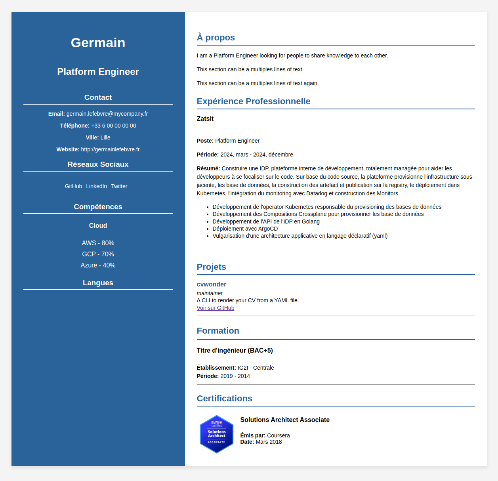

# CV Wonder Themes - Basic

## Getting Started

```bash
cvwonder themes install https://github.com/germainlefebvre4/cvwonder-theme-basic
cvwonder generate --input=cv.yml --theme=basic
```

## Preview

HTML render:



From YAML (partial):

[CV Wonder - cv.yml](https://github.com/germainlefebvre4/cvwonder/blob/main/cv.yml)
